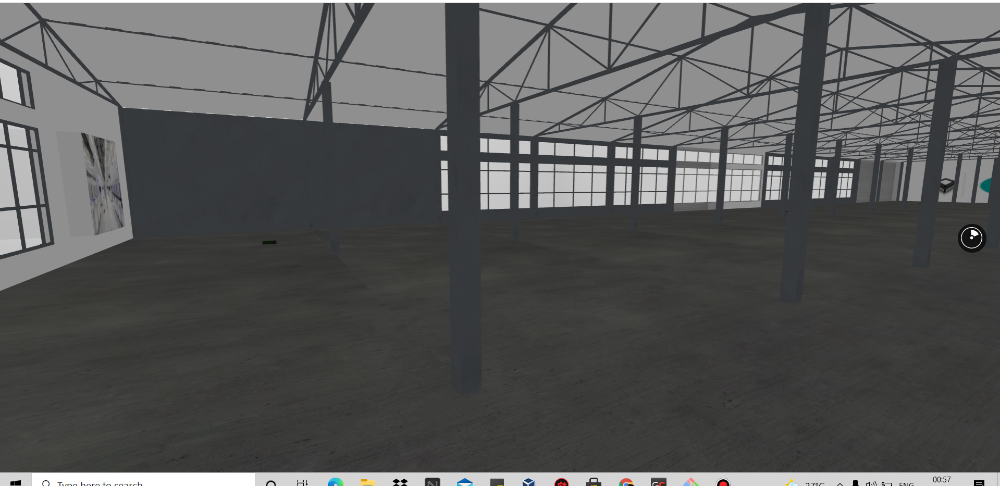
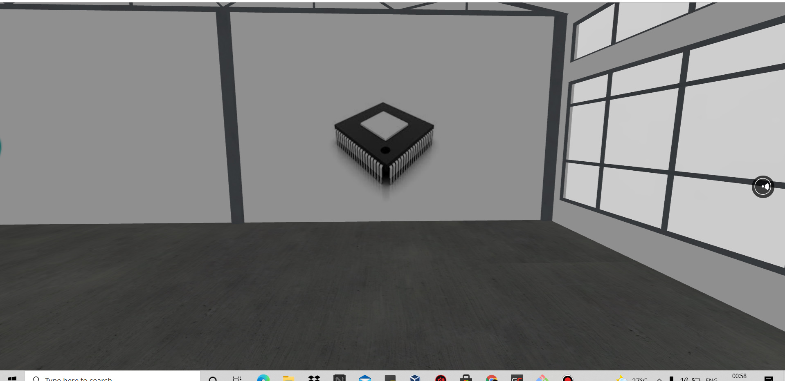
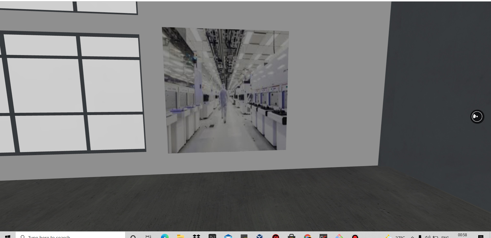
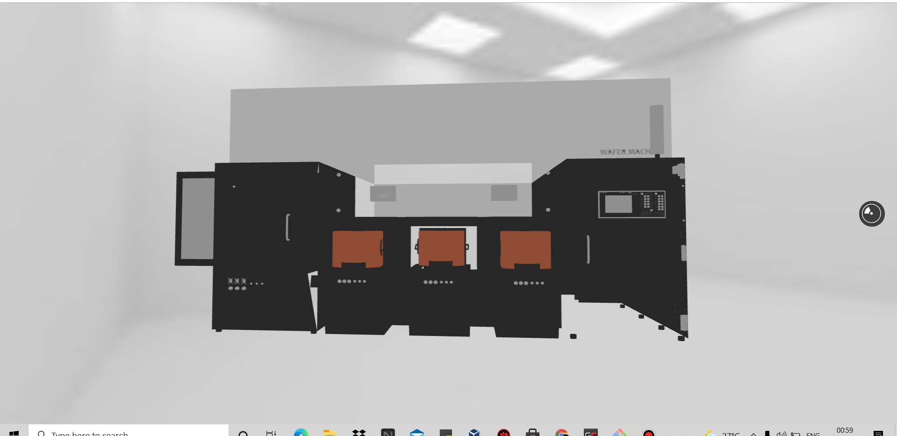
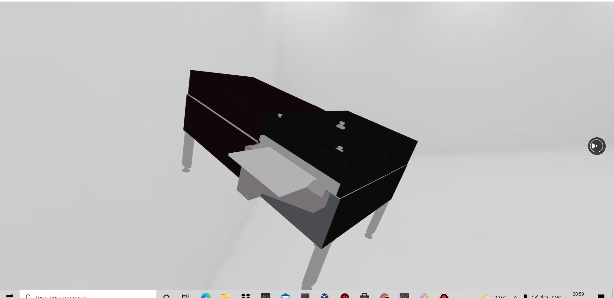
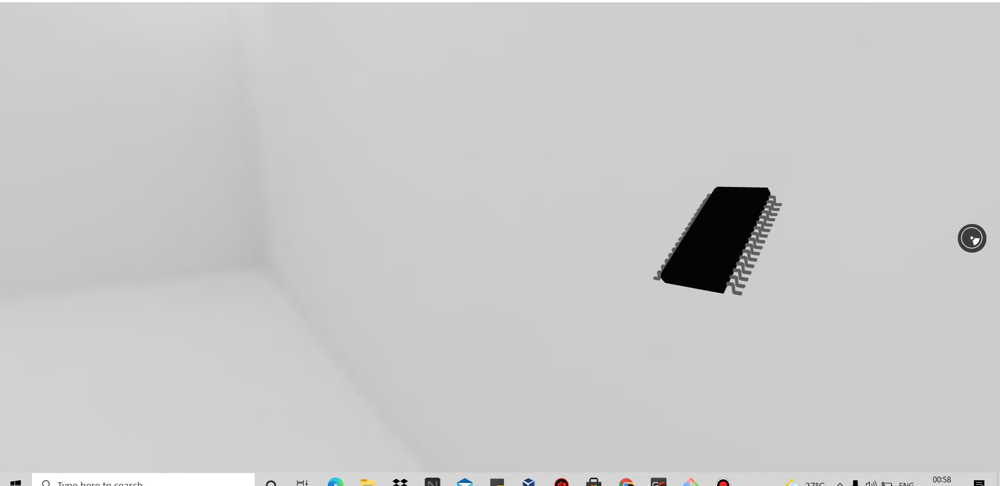
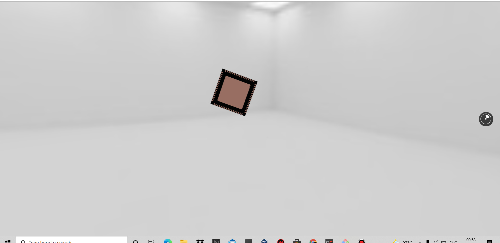

# VR Tour of Semiconductor fab/assembly facility

### VR in Manufacturing

#####1. Workplace Design and Layout: 
Complex, automated facilities are expensive to lay out. VR reduces risk and can accelerate implementation by allowing engineers to quickly identify problems. Safety and workplace ergonomics are particular beneficiaries as both manufacturers and equipment builders adopt VR. Additionally, if you are curious to learn more about VR safety training, you might want to visit the 360 Immersive website.

#####2. Equipment Design: 
A builder of complex production equipment is using VR to identify potential problems before the equipment is built. This reduces the risk of delays and costly rework.

#####3. Training: 
Total immersion in a digital twin world is an excellent way to train employees and enable them to practice specific skills. Examples include planning machine and line changeovers and rehearsing emergency drills. When used in this way, VR helps to avoid costly downtime while simultaneously reducing the risk of errors or poor decision-making.

* This work consists of Virtual facility tour - 

1. `Assembly Area`

2. `Fab Area`

3. `Wafer Machine`

4. `Wafer Cutter`

5. `SOIC chip`

6. `QFN chip`

